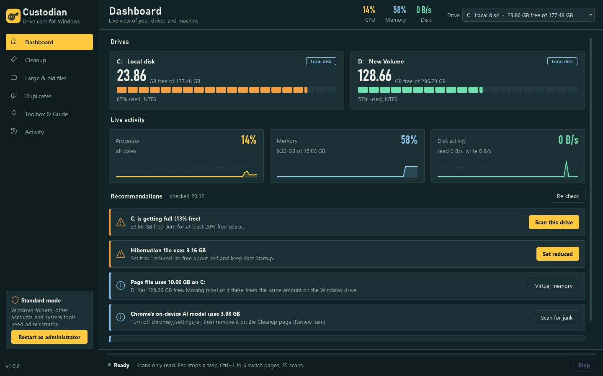
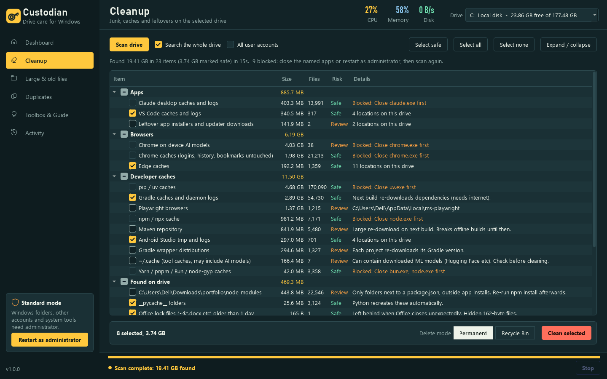
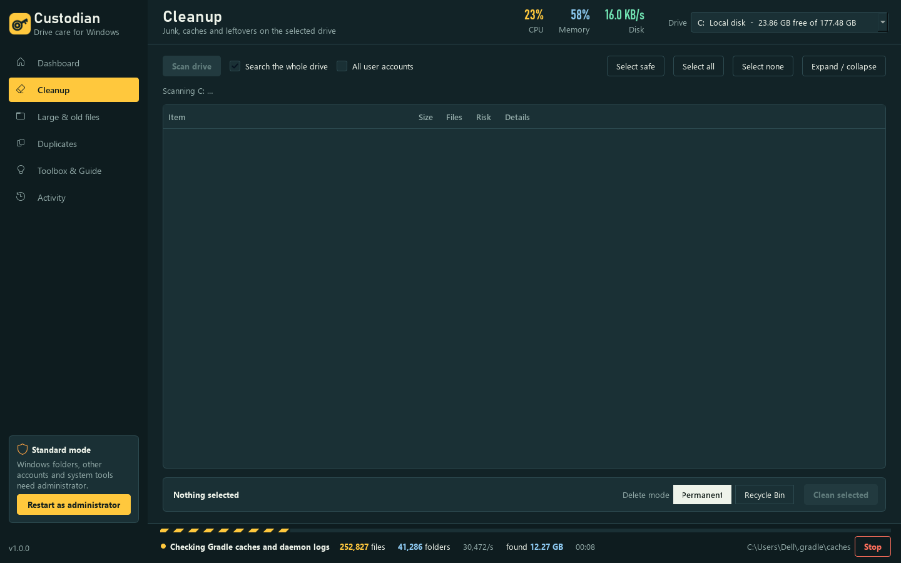
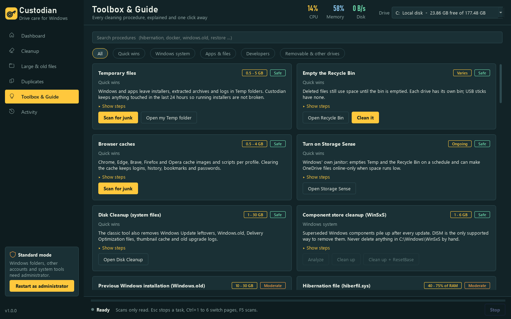

# Custodian

Drive care for Windows. Custodian scans any local drive, explains what is taking space, and cleans
only what you approve. It has guard rails that stop it from touching Windows, program folders or your
personal folders.



| Cleanup results | Live scan progress |
|---|---|
|  |  |



## Features

| Page | What it does |
|---|---|
| **Dashboard** | Live drive gauges that light up when free space changes. Live CPU, memory and disk activity charts. Recommendations based on your machine (low space, hibernation file, page file, Windows.old, WSL disks, and more). |
| **Cleanup** | Temp folders, Windows Update cache, crash dumps, and browser, app and developer caches (npm, pip, uv, Gradle, Maven, NuGet, JetBrains...). It can cover every user account. It also searches the whole drive for `node_modules`, `__pycache__`, test caches, dump files, Office lock files and macOS metadata. |
| **Large & old files** | Finds the biggest files, with an optional "not modified for N days" filter. Sortable, and you can open a file before deciding. |
| **Duplicates** | Finds files with identical content (size, then a quick hash, then a full hash). Hard links are ignored. One-click "keep oldest" or "keep newest". |
| **Toolbox & Guide** | 36 cleaning procedures, each with its risk, typical impact, steps and one-click actions. Covers DISM component cleanup, hibernation, page file, restore points, Delivery Optimization, Compact OS, reserved storage, Docker/WSL compaction, package-manager clean commands, and more. |
| **Activity** | Colour-coded log of every action, also saved to `%LOCALAPPDATA%\Custodian\logs`. |

**Always available:**
- **Stop** button (Esc) during any scan or clean.
- **Delete mode** per page: *Permanent* (frees space now) or *Recycle Bin* (recoverable).
- Keyboard shortcuts: Ctrl+1–6 switch pages, F5 scans.

## Guard rails

- Scanning is read-only. Deleting needs a confirmation that shows the total size, the mode, and every item marked *Review*.
  Permanently deleting personal files needs an extra "I understand" tick.
- Every path is checked again right before it is deleted:
  - Always refused: drive roots, `Windows`, `Program Files`, `ProgramData`, every account's profile and its
    Desktop/Documents/Downloads/AppData folders.
  - Refused at any depth: `System32`, `WinSxS`, `Installer`, `System Volume Information`, `Recovery`.
- Junctions and symlinks are never followed or removed. Any path that passes through one is refused.
- Deleting is limited to the drive that was scanned. Changing the drive clears the results.
  Network and optical drives are not offered.
- Caches of running apps (Chrome, VS Code, Gradle...) are blocked. This is checked again at clean time.
- Temp and log folders keep files changed in the last 24 hours.
- Large files and duplicates are only removed if their size and timestamp still match the scan.
  At least one copy of every duplicate set is always kept.
- Recycle Bin mode is refused on drives that have no Recycle Bin (USB sticks).
- Handles paths longer than 260 characters and read-only files. Runs as a single instance and keeps a crash log.

## Download and run

Download `Custodian.exe` from the [latest release](https://github.com/Prathamesh2640/Custodian/releases/latest)
and run it. It needs no installation and no Python.

It starts without admin rights, so there is no UAC prompt. Click **Restart as administrator** in the sidebar
to clean Windows folders and other accounts, and to run system procedures.

> **"Windows protected your PC"?** Releases are not code-signed yet (see *Code signing policy*), so Windows
> SmartScreen asks once for any downloaded copy. Click **More info → Run anyway**, or right-click the file →
> **Properties** → tick **Unblock**. Building from source avoids the prompt entirely.

## Build from source

Requires Windows and Python 3.12.

```bat
build.bat
```

The script:
1. Creates `.venv` and installs `requirements.txt`.
2. Runs `tests\test_engine.py`. The build stops if any guard-rail test fails.
3. Produces `dist\Custodian.exe` with an icon and version information.

Run from source instead:

```bat
.venv\Scripts\python src\main.py
```

### Project layout

```
src/
  main.py        window, pages, task runner
  engine.py      scanning, cleaning, guard rails (no Qt, fully testable)
  rules.py       what gets cleaned: paths, risk, locking apps, minimum age
  knowledge.py   procedures guide and machine recommendations
  monitor.py     live CPU / memory / disk readings (Windows APIs)
  theme.py       palette, type and style sheet
  widgets.py     storage bars, hazard-tape progress, sparklines, drive cards, dialogs
  make_icon.py   regenerates icon.ico (platter key logo)
tests/
  test_engine.py guard-rail and deletion checks
packaging/
  version_info.txt  exe version resource
```

To add a cleanup target, add a rule in `src/rules.py`. Every path a rule produces still has to pass the guard rails.

## Code signing policy

Custodian will use free open-source code signing from [SignPath Foundation](https://signpath.org).
Until the project is approved, release binaries are unsigned.

Once approved:
- Only builds made by this repository's GitHub Actions workflow, from a `v*` tag, are submitted for signing.
  Nothing built on a personal machine is signed.
- Each signing request needs manual approval by a maintainer.
- Every release lists its commit, and the workflow file shows exactly how the exe was built.

| Role | Members |
|---|---|
| Committers and reviewers | [Prathamesh2640](https://github.com/Prathamesh2640) |
| Approvers | [Prathamesh2640](https://github.com/Prathamesh2640) |

**Privacy:** Custodian does not send any data anywhere. It has no telemetry, update checks or network access.
Logs stay on your PC in `%LOCALAPPDATA%\Custodian\logs`.

**Enabling signing in CI:** once SignPath approves the project, set these on the GitHub repository:
- the secret `SIGNPATH_API_TOKEN`;
- the variable `SIGNPATH_ORGANIZATION_ID`;
- the variables `SIGNPATH_PROJECT_SLUG` and `SIGNPATH_POLICY_SLUG`, if they are not `Custodian` and `release-signing`.

The next tagged release is then signed automatically.
In the SignPath project, set the artifact configuration to a ZIP file containing `Custodian.exe`.

## License

[MIT](LICENSE)
